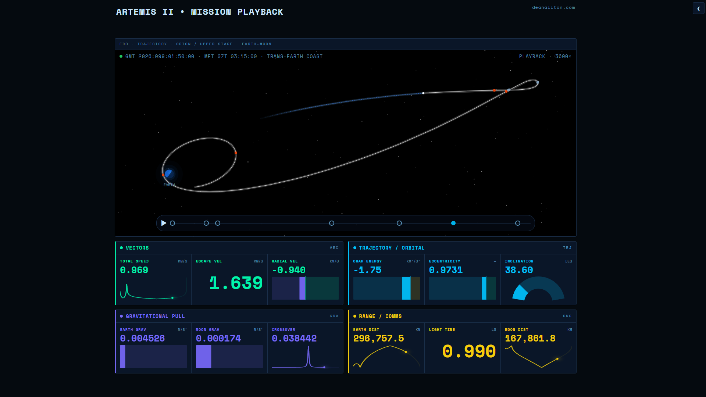

# Artemis II • Mission Tracker

A mission control-style dashboard visualizing the Artemis II lunar flyby trajectory
in real time. Built with Python, Dash, Plotly, and DuckDB.



---

## What It Is

Animates Orion's 9-day Earth-Moon-Earth trajectory at 3600× speed (1 hour per second), driven by 12,836 state vectors at 1-minute resolution from NASA JPL Horizons.

**Trajectory panel** - top-down 2D view of the Earth-Moon system with a live spacecraft marker, accumulated past arc, dashed return arc, and labeled mission event markers (propulsive burns and physics events).

**Phase scrubber** - seven clickable mission phase markers drive the entire dashboard. Jump to any phase or play/pause animation from any position.

**Telemetry panels** - four live data groups updating on phase change:
- **Vectors** - total speed, escape velocity, radial velocity
- **Trajectory / Orbital** - characteristic energy (C3), eccentricity, inclination
- **Gravitational Pull** - Earth and Moon gravitational accelerations
- **Range / Comms** - Earth distance, one-way light time, Moon distance

---

## Live Demo

[artemis-ii-mission-playback.deanallton.com](https://artemis-ii-mission-playback.deanallton.com)

---

## Mission window

`2026-Apr-02 01:59 UTC` → `2026-Apr-10 23:54 UTC`

The dataset does not begin at launch. JPL Horizons only has trajectory data for Orion once DSN ground stations acquired the signal after orbital insertion - approximately T+3.5 hours after SLS liftoff. The final ~13 minutes of the mission (reentry through splashdown) are also absent: the plasma sheath surrounding the capsule during atmospheric reentry blocks all radio communication, cutting off tracking data before the vehicle reaches Earth's surface.

---

## Setup

```bash
# Clone and create virtual environment
git clone https://github.com/HelioCentrik/artemis-ii-mission-playback
cd artemis-ii-mission-playback
python -m venv .venv
source .venv/bin/activate      # Windows: .venv\Scripts\activate

# Install dependencies
pip install -r requirements.txt

# Launch the dashboard
python main.py
```

Then open `http://127.0.0.1:8050`.

> The database (`data/artemis2.duckdb`) is included in the repo — no build step required. To rebuild it from JPL Horizons, run `python scripts/init_db.py`.

Then open `http://127.0.0.1:8050`.

---

## Deployment

Serve with Gunicorn:

```bash
pip install gunicorn
gunicorn main:server --workers 2 --bind 0.0.0.0:8050 --timeout 120
```

No environment variables are required. The DuckDB file is committed to the repo and loaded into memory at startup — there are no external API dependencies at runtime.

The live demo## Deployment

Serve with Gunicorn:

```bash
pip install gunicorn gevent
gunicorn main:server \
  --workers 2 \
  --worker-class gevent \
  --worker-connections 50 \
  --timeout 120 \
  --bind 0.0.0.0:8051
```

The live demo runs behind a Cloudflare tunnel on a self-hosted Linux server, managed as a systemd service. Any reverse proxy or tunnel setup that can forward HTTP to the Gunicorn port will work.

Gevent async workers are required — the default sync worker class serialises concurrent video requests on the home page, causing sequential load times. runs behind a Cloudflare tunnel on a self-hosted Linux server, managed as a systemd service. Any reverse proxy or tunnel setup that can forward HTTP to the Gunicorn port will work.

---

## Project Structure
app/              Python modules - config, data layer, figures, telemetry  
assets/           CSS and clientside JS (playback animation hot path)  
components/       `[ needs description ]`  
scripts/          Horizons client, DB init, validation probes  
main.py           Dash entrypoint - layout and callback wiring only

---

## Stack

| Layer | Technology                      |
|---|---------------------------------|
| Language | Python 3.13+                    |
| Dashboard | Dash (Plotly)                   |
| Data store | DuckDB                          |
| Ephemeris | JPL Horizons REST API           |
| Visualization | Plotly (3D scatter, animations) |

---

## Data Source

Ephemeris data retrieved from the [JPL Horizons REST API](https://ssd.jpl.nasa.gov/horizons/).

| Object | Horizons ID | Type |
|---|---|---|
| Orion spacecraft (Artemis II) | `-1024` | VECTORS + ELEMENTS |
| Moon | `301` | VECTORS |
| Sun | `10` | VECTORS |

All data is geocentric ICRF, 1-minute step size.

---

## Data Pipeline

```
JPL Horizons API
      │
      ▼
scripts/fetch_horizons.py   ← pulls raw trajectory CSV
      │
      ▼
scripts/init_db.py          ← parses and writes to DuckDB
      │
      ▼
data/artemis2.duckdb        ← orion_trajectory table (12,836 rows)
```

------

## Attribution

Trajectory data provided by the NASA Jet Propulsion Laboratory Solar System Dynamics
Group via the [JPL Horizons System](https://ssd.jpl.nasa.gov/horizons/).